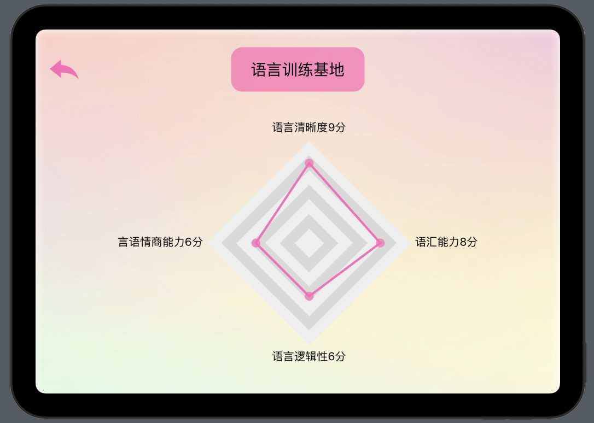

<div align=center>

</div>
<h1 align=center>TalkDrawing妙语生画</h1>

<p align=center>
<a href="https://developer.apple.com/swift"></a>
<a href="https://developer.apple.com/ios"></a>
<a href="https://github.com/Cay-Zhang/SwiftSpeech/blob/master/LICENSE"></a>
</p>

- [📖 简介](#:book:-简介)
- [👾 功能和内容展示](#:space_invader:-功能和内容展示)
- [🤯 当前作品问题和改进方向](#:exploding_head:-当前作品问题和改进方向)
- [🍺 交流 & 合作](#:beer:-交流-&-合作)

## :book: 简介

TalkDrawing妙语生画是一款面向3-8岁儿童的思维启蒙APP——妙语生画。在2023中国高校计算机大赛-移动应用创新赛中荣获全国三等奖。作品宣发视频[在这里](https://oss.moocollege.com/unknow/works/10648559/1DZU0mQv_1692881155076.mp4)

## :space_invader: 功能和内容展示

本项目接入了百度智能云平台的[Ai绘画](https://ai.baidu.com/tech/creativity/ernie_Vilg),若需要正常使用功能二的图像生成，需在工程下Model-->DrawingGameModel修改下列access——token为你的密钥，往期工程文件的测试密钥我已经更新无效化处理。

```swift
    /// 密钥access_token
    private let access_token = "Your Access_token"
```

<div align=center>

</div>

TalkDrawing有三大功能以下三大功能--主页面的精选绘本暂未开发，只是滚动视图。

### 故事闯关式涂鸦

在故事闯关式涂鸦，可选择故事进行闯关----目前只准备了经典儿歌板块的《门前大桥下》和《小燕子》以及四大名著板块的《石猴出世》🥹----其中《小燕子》只有拖拽上色交互。其余两个都先要进行语音交互，再进行拖拽上色交互。点击左下角小喇叭可以播放整个故事。

<div align=center>

</div>

### 语音日记式涂鸦

该模块中可以拿起画笔尽情涂鸦，遇到不会的画的情景或者物品可以点击左下角的语音按钮进行描述，检查灰色区域文字描述是否与所说一致。若一致则可以点击灰色区域等待8-15秒则可生成提示图片。此外，可点击右上角向右➡️跳转到下一个模块。最后可以保存连环画，手机相册和功能三的宝宝作品都能留有记录。

<div align=center>

</div>

### 我是故事演说家

该模块中可以点击故事情节回顾，自动播放视频和音频回顾故事。然后点击亲子分享乐园，随后立即点击下面蓝色语音按钮进行故事讲述，完成讲述后点击停止录音。则可以查看生成的语言能力分析报告。


<p align=center>


</p>


## :exploding_head: 当前作品问题和改进方向

- StoryGame的模组数据复杂,目前暂未实现长期化存储

- 调用的第三方SwiftSpeech库存在bug，真机演示时需要提前开启录屏且开启录音功能，才能正常使用语音按钮。基于这一问题，后续放弃使用第三方库，自定义使用Speech框架。


## :beer: 交流 & 合作

您可以通过以下几种方式支持我的项目：

- 分享项目：如果您认为我的项目非常有价值，那么请考虑分享项目链接给您的朋友和同事。这将有助于我的项目得到更多的关注和支持。如果可以请给一个小小的star！

- 提供反馈：您可以通过提交Issues或者Pull Requests来帮助改进我的项目。如果您发现了任何错误或者您认为我的项目可以改进的地方，欢迎随时向我提供反馈。

- 与我合作：如果您对该项目感兴趣，想加入开发或有定制化需求，欢迎随时与我联系。

总之，非常感谢您对我的项目的支持，我将持续完善这个项目，让它更好地为您提供参考和服务。

